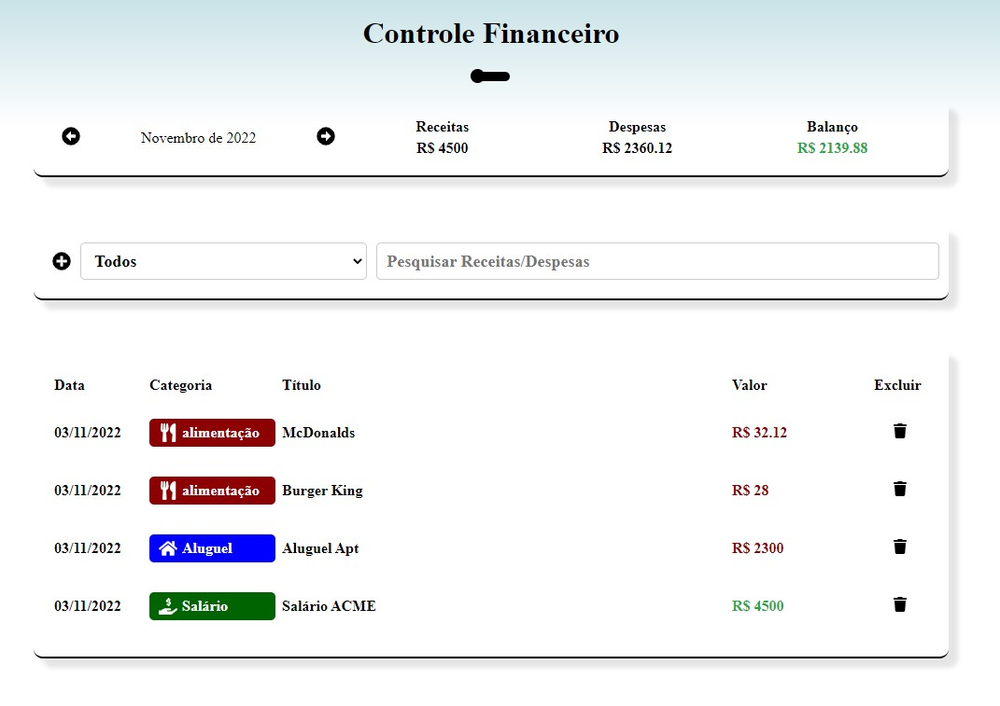

# Person Finances ! 🤑
 

## Controle seus gastos. 😃 

### [Person Finances](https://react-js-person-finances.netlify.app/) 🔗

## Tecnologias que utilizei para o projeto ;  

 
    
    
    
    

 

##  As funcionalidades:
- Cadastrar despesas | receitas ;
- Excluir despesas | receitas ;
- Escolha mês ;
- Modal ;
- toggle themer ;
## O código foi desenvolvido usando os conceitos ; 
- Hooks ; useState, useEffect, useReducer e useContext ;
- Theme Switcher
- As rotas foram criadas com React Router Dom 6.
- Resposivo
## A estilização ; 
- Styled Components; 
## Dependencias ; 
- react-switch ; 
- react-tooltip ; 
- React Router Dom dentre outros. 
## 🎲 Rodando o Back End (servidor)
- npm install
- npm start

